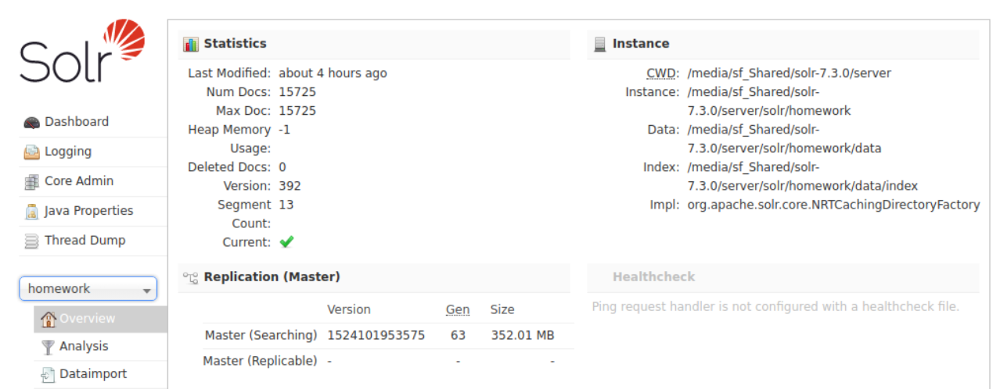
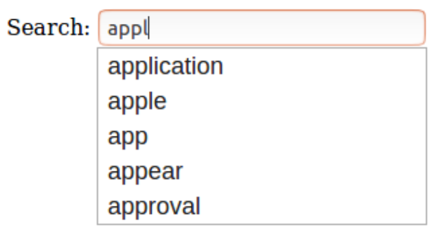

# Search Engine

An implementation of web search engine using multiple ranking strategies including [Apache Solr](http://lucene.apache.org/solr) [TFIDF](https://en.wikipedia.org/wiki/Tf%E2%80%93idf) similarity and [Google PageRank](https://en.wikipedia.org/wiki/PageRank) algorithm.

## Getting Started

This project used Apache Solr as a standalone full-text search server. It uses the Lucene Java search library at its core for full-text indexing and search.

### Apache Solr Installation

* [Apache Solr](http://lucene.apache.org/solr/mirrors-solr-latest-redir.html) - Latest Apache Solr release version
* [Solr Tutorial](http://lucene.apache.org/solr/quickstart.html) - Solr installation instructions

### Indexing Web Pages

Start Solr server.

```shell
bin/solr start
```

Create a new core.

```shell
bin/solr create –c myexample
```

Modify **managed-schema** file then indexing crawled pages.

```shell
bin/post –c myexample –filetypes html crawl_data/
```

Check Solr server control panel at [http://localhost:8983/solr](http://localhost:8983/solr). We can also configure Solr to default querying by using requestHandler in the **solrconfig.xml** file.



## Deployment

Create a PHP client that accepts input from the user in a HTML form, and sends the request to the Solr server. For this implementation I am using the [solr-php-client](https://github.com/PTCInc/solr-php-client) and modify it to use different ranking algorithms.

### PageRank

To compute PageRank scores I create external file contains a mapping from a key field to the field value. First, use [Jsoup](https://jsoup.org) library with Java to list the links in the webpage
and output **edgeList.txt**. After that using [NetworkX](https://pypi.python.org/pypi/networkx/) library to compute the incoming and outgoing links to the web pages, and create a NetworkX graph. Then compute the PageRank for this graph and store this in **external_pageRankFile.txt**. Also, modify **managed-schema** to refers to this score.

* [edgeList.txt](PageRank/edgeList.txt) - Pages link list
* [external_pageRankFile.txt](PageRank/external_pageRankFile.txt) - PageRank scores

### Query Test


## Spelling Correction

### Implementation Process

* To add a spell check feature, I modify a version of [Peter Norvig](https://norvig.com/spell-correct.html)’s spelling program written in PhP ([SpellCorrector.php](Engine/SpellCorrector.php)).
* Create corpus to calculate edit distance for NBC news ([big.txt](Engine/big.txt)), by develop a parser written in JAVA using Apache Tika framework ([TikaParser.java](Engine/TikaParser.java)) to parse all HTML file into strings.
* Placed [SpellCorrector.php](Engine/SpellCorrector.php) and [big.txt](Engine/big.txt) in the search engine directory, the script will take in a corpus text file and calculate edit distance. To optimize performance, the serialized dictionary is saved on a file into a text file ([serialized_dictionary.txt](Engine/serialized_dictionary.txt)) instead of parsing every single execution.
* Modify [index.php](Engine/index.php) to use **correct()** function from [SpellCorrector.php](Engine/SpellCorrector.php) script to correct the query search.

### Spelling Correction Test


## Autocomplete

### Implementation Process

* To implement the autocomplete functionality while using Solr, I used **FuzzyLookupFactory** feature of Lucene.
* First, modify **solrconfig.xml** and add a search component. The field used to obtain the terms for suggestion. The **lookupImpl** parameter defines the algorithms used to look up terms in the suggest index.
* Next, add a request handler to configure **default** parameters for serving suggestion requests.
* Reload the Solr core.
* Create Javascript file to take input terms from user and send a suggest request to Solr. Retrieve suggestion JSON from Solr using AJAX. Parse and extract a suggestion list ([autocomplete.js](Engine/autocomplete.js)).

### Autocomplete Test



## Snippets

### Implementation Process

* For creating web snippets, I use PHP Simple HTML DOM Parser ([simple_html_dom.php](Engine/simple_html_dom.php)) to parse HTML file and extract the content.
* Develop a script ([snippets.php](Engine/snippets.php)) to process the content on each webpage and searching for query terms.
* Placed [simple_html_dom.php](Engine/simple_html_dom.php) and [snippets.php](Engine/snippets.php) in the search engine directory.
* Modify [index.php](Engine/index.php) to display snippets in the description section of search results. Also highlight query terms in the snippet to make it standout.

### Snippets Test


## Developer

* **Soravis Taekasem** - Developer

## Data Source

* [NBC News](https://www.nbcnews.com) - National Broadcasting Company News